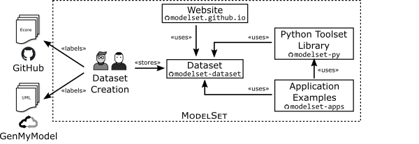

## ModelSet. A Labelled Dataset of Software Models for Machine Learning

ModelSet is a dataset of software models which have been manually labelled and curated in order to foster research in Machine Learning and Model-Driven Engineering. 

The dataset contains **5,466 Ecore models** and **5,120 UML models**, and is provided with a set of Java and Python libraries to facilitate its use and illustrate its potential applications. 

This organization includes the repositories implementing the main components of ModelSet.
The following figure illustrates the architecture:

The components and the corresponding repositories are:

* **Dataset**. This component includes the relational databases and a set of Java-based tools to facilitate the release of new versions of the dataset. The project’s name of this component is [modelset-dataset](https://github.com/modelset/modelset-dataset).

* **Python Toolset Library**. This library aims at facilitating loading ModelSet and using it to train ML algorithms in Python-based enviroments. The project’s name of this component is [modelset-py](https://github.com/modelset/modelset-py).

* **Application examples**. This component contains illustrative examples using ModelSet to perform simple ML tasks with software models. The project’s name of this component is [modelset-apps](https://github.com/modelset/modelset-apps).

* **Website**. This component includes the code of the website of the tool, intended to explore the models and the labels of ModelSet. The project's name of this component is [modelset.github.io](https://github.com/modelset/modelset.github.io).

We welcome contributions to any repository, please review their individual contribution guidelines. Apart from the typical `README.md` file, you will also find `CONTRIBUTING.md`, `GOVERNANCE.md`, and `CODE_OF_CONDUCT.md` files describing the contribution guidelines.